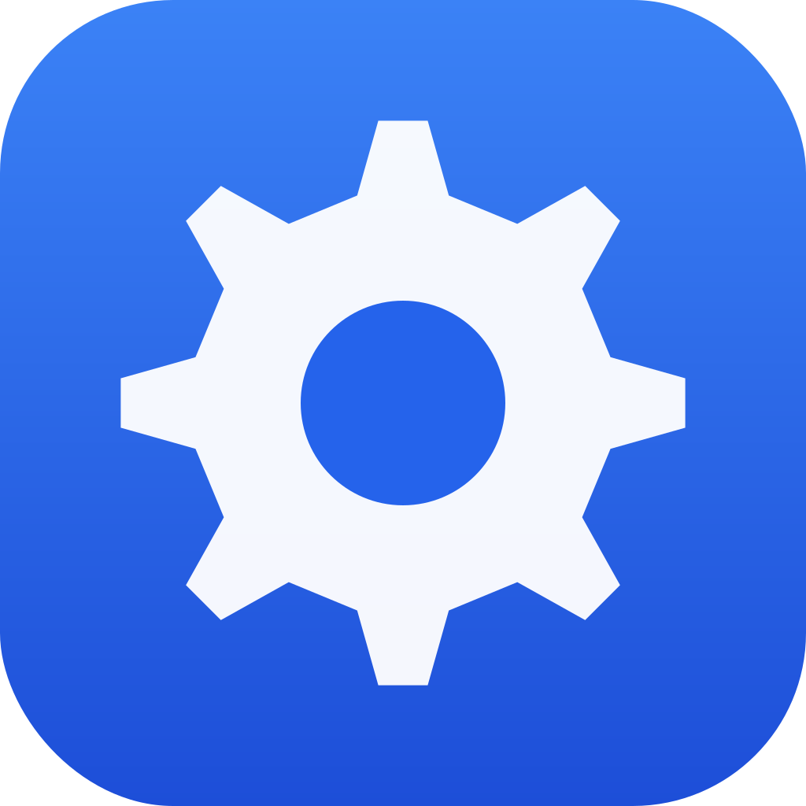

  

<h1 align="center">Service Manager</h1>

A macOS menu bar app for managing local development services and Tailscale funnels.

---

## Why?

I build a lot of custom services — particularly [MCP servers](https://modelcontextprotocol.io/) that give AI assistants access to things like Apple Reminders, Calendar, Obsidian, and more. Each one needs to be running locally, and many need to be exposed over the internet via a reverse proxy so they can be reached from remote clients.

Managing all of this by hand gets old fast: starting each service in its own terminal tab, remembering which ports map to which Tailscale funnel paths, restarting things when they crash. Service Manager puts it all in one place — services and their reverse proxy mappings side by side, running quietly in the menu bar.

## Features

- **Menu bar app** — runs in the background, configure via the menu bar icon
- **Service management** — start, stop, and restart local services with a single click
- **Live console** — real-time stdout/stderr log tailing for each service
- **Auto-restart** — crashed services restart automatically with exponential backoff and a live countdown
- **Tailscale Funnel** — view and manage Tailscale funnel mappings, auto-synced from your live config
- **Independent permissions** — services run via launchd so each gets its own macOS privacy permissions, separate from the app
- **Launch on startup** — services marked as auto-start begin running when the app launches

## Installation

1. Open `Service Manager.xcodeproj` in Xcode
2. Build the project (⌘B)
3. Run `./install.sh` to copy to `/Applications`

## Usage

Click the server icon in the menu bar to access:

- **Configuration** — opens the main window to manage services and funnels
- **Quit** — stops all running services and exits (with confirmation if services are running)

### Adding a Service

1. Open Configuration from the menu bar
2. Click the `+` button in the sidebar
3. Enter a name, command (e.g. `npm run start`), and working directory
4. Optionally set environment variables and auto-restart/auto-start preferences

### Tailscale Funnels

The Funnels tab automatically syncs with your existing Tailscale funnel configuration. You can also add, edit, and remove funnel mappings from within the app.
